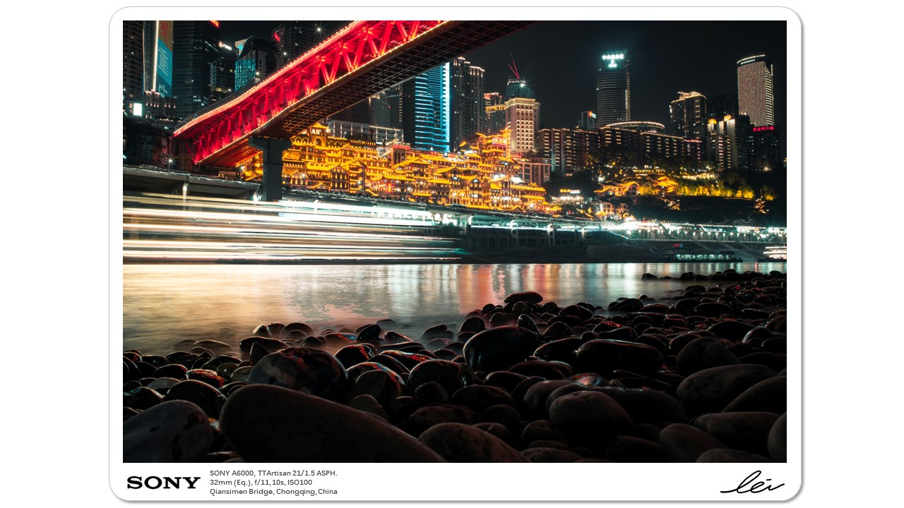
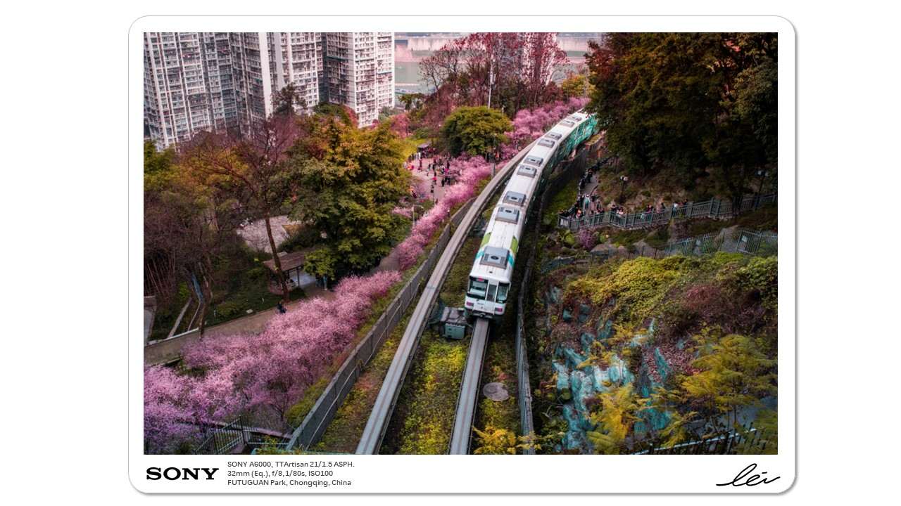
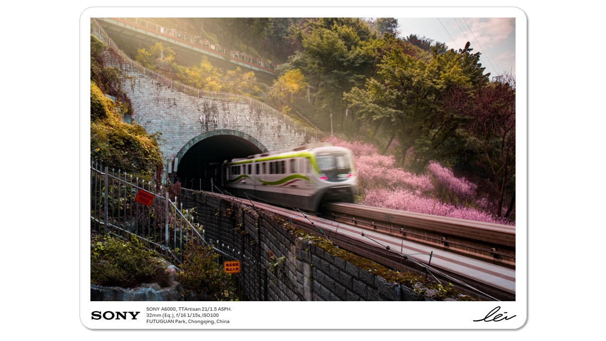
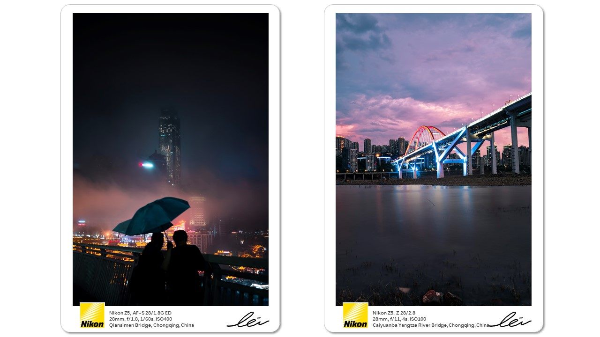
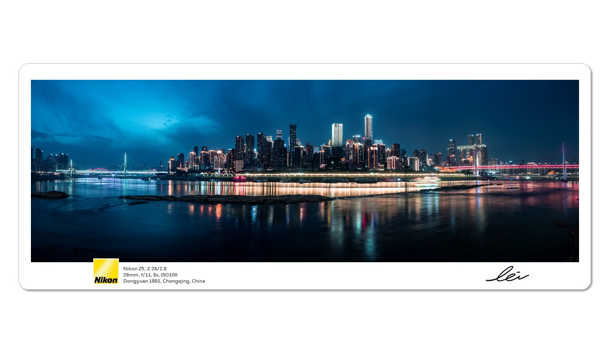
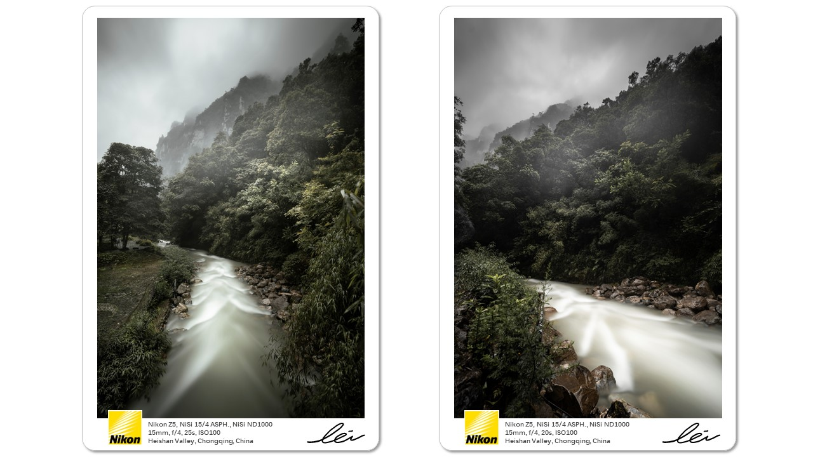
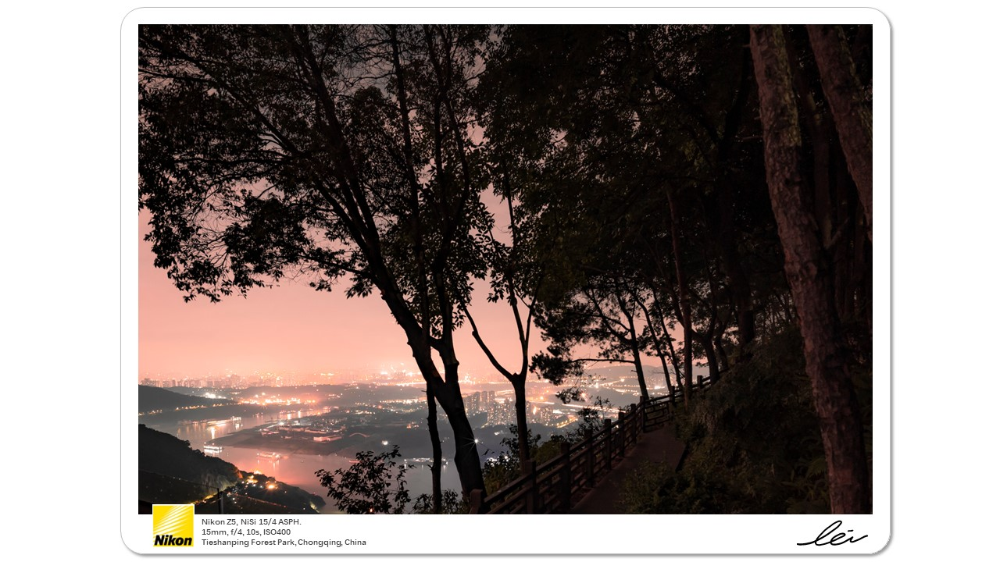
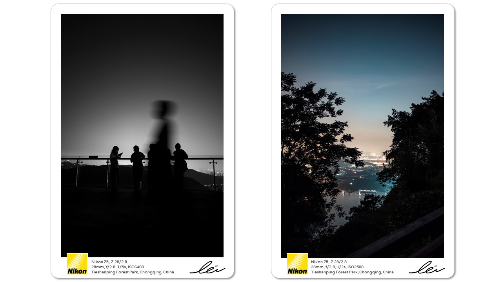

This is the Qiansimen Bridge and the Hongyadong in Chongqing, which is very famous on account of its special combination of modern bridge and old-style building. This photo was taken across the Jialing River. The slow shutter was applied to blur the visitor ship, the colorful lights reflected by the mirror-like river were so spectacular.

Every March in Chongqing is called as ‘Time for Sakura’. The best position to record this moment is always Futuguan Parks, at which the No.2 Subway will run across the Sakura. The post-process of these photos is inspired by painting, a lower white balance is applied to strengthen the atmosphere of peace.

There are many stories in Chongqing’s bridges. People and subways go across the bridges every day, leaving countless memorable moments. 
[1]The first photo was taken on a rainy evening, while two people were enjoying the foggy Yuzhong Peninsula, the strong contrast of dark blue and orange represented the prosperity of traditional Chongqing’s life. 
[2]The second photo was taken at a park, and the technique of time composition was applied to correctly capturing the pink cloud and lighted bridge, which depicts the modern side of Chongqing’s life.
[3]The third photo is a panorama. Two bridges are distributed with balance, while the middle part is Jiefangbei CBD, one of the most prosperous regions in Chongqing.

These two photos were taken at the Heishan Valley. It was my first time to use a 15mm ultra-wide-angle lens for photography. Thanks to the great water-sealed body of Nikon, I could record the moment with extremely low speed in such a heavy rain.

I used to visit Tieshanping Forest Park and have taken lots of photos, but these three ones are the best. In the evening, everything is going to be tranquil, many trees and the colorful city will accompany animal and people for hiking.

Written by Yichen Liu 09-03-2023
