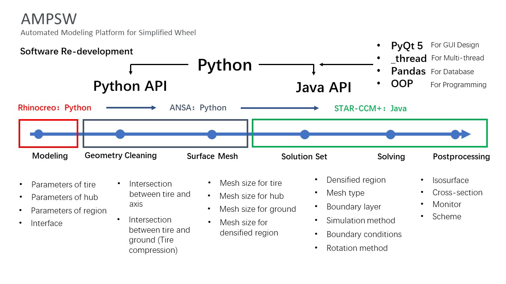
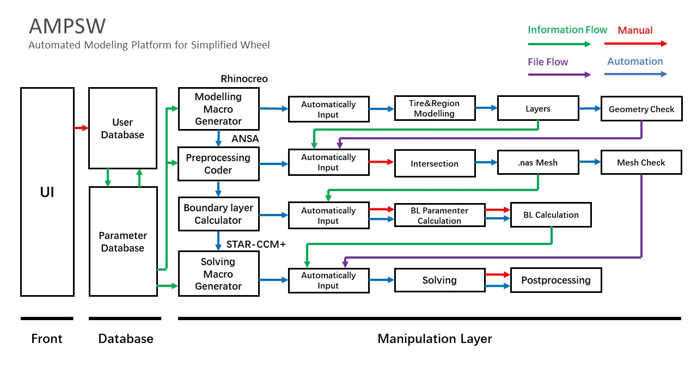
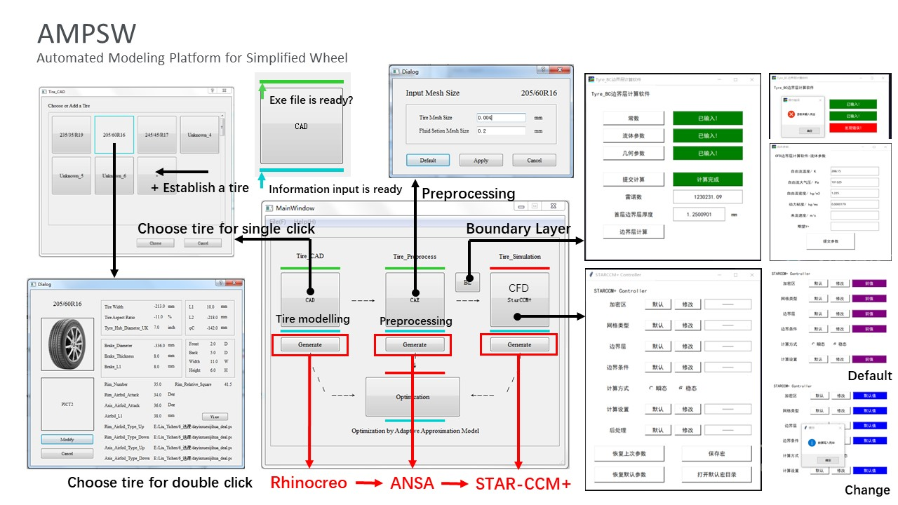
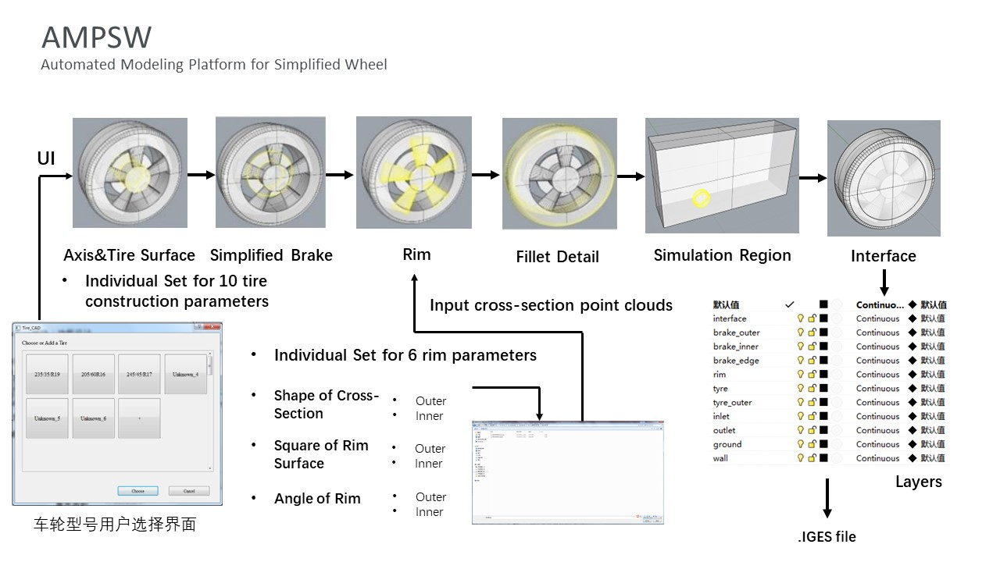
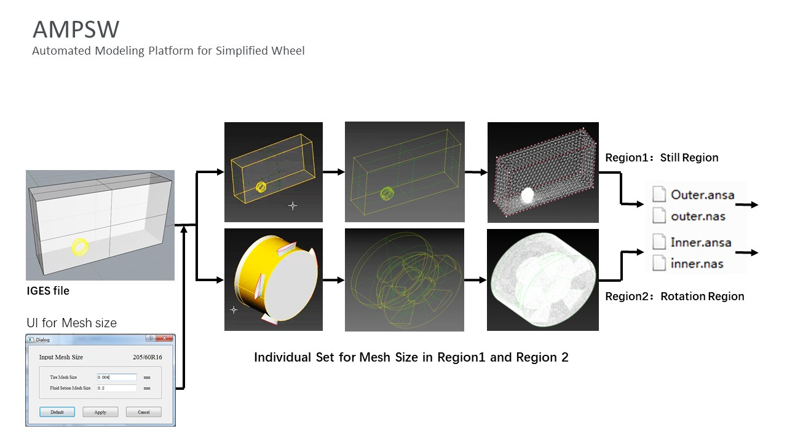
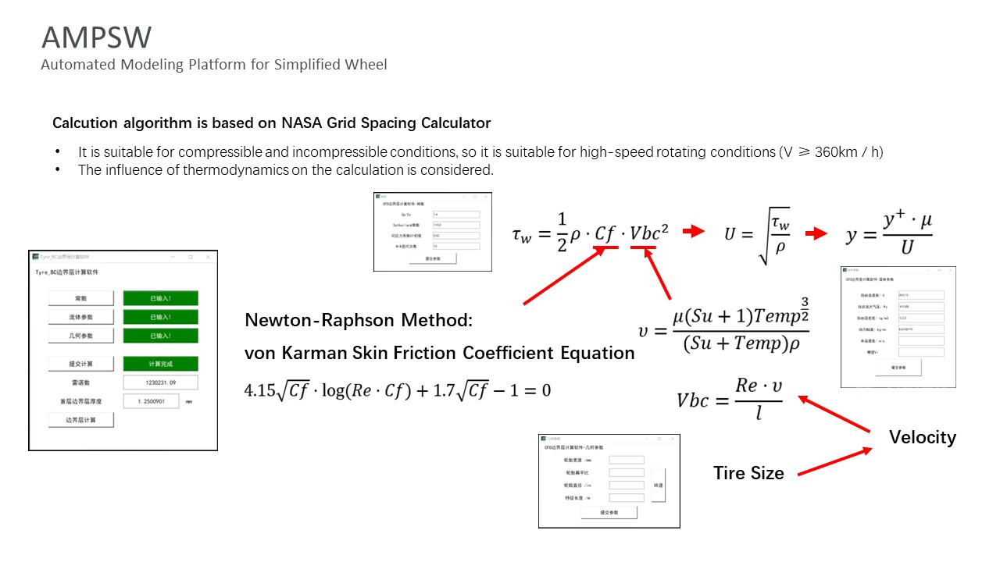
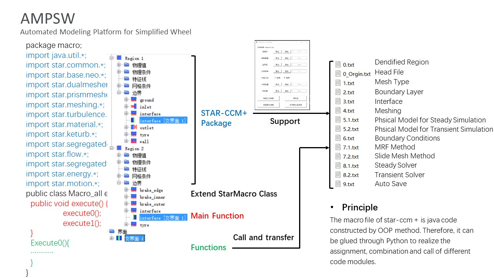
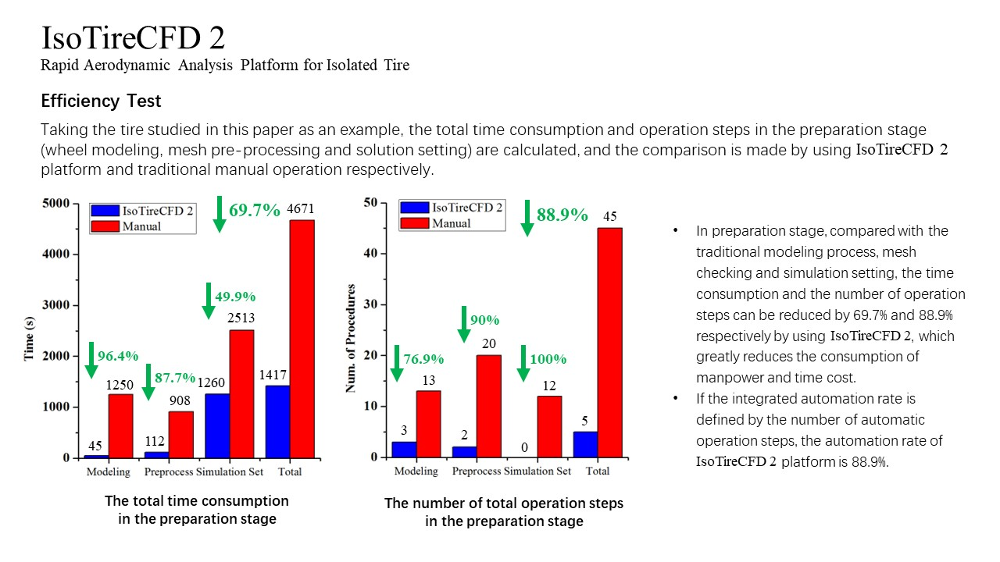

The AMPSW(Automated Modeling Platform for Simplified Wheel, or IsoTire CFD 2 in my master's dissertation) is developed for automated workflow of wheel modeling and CFD simulation. It contains a specific and fixed modeling method for a series of wheels with any parameters, so it could be called as the wheel standard model. One can use this program for isolated wheel CFD simulation or multi-wheel vehicle CFD simulation, even made it in wind tunnel test with 3D printing technology.

This platform was developed by Python and commercial software redevelopment ([Rhinoceros](https://www.rhino3d.com/en/), [ANSA](https://www.beta-cae.com/ansa.htm) and [STAR-CCM+](https://plm.sw.siemens.com/en-US/simcenter/fluids-thermal-simulation/star-ccm/)). It links different stages of a typical CFD simulation corresponding to different software, including modeling, pre-processing and simulation. 

Taking user-friendly interface as one of the most important aspect in development, the program has a user database to store the data for different users. In addition, some useful tools, such as Boundary Layer Calculator, are embeded for fast calling. Meanwhile, the number of the manual procedure of this program is designed as least as possible, unless the software limitation.

[1st Stage] The wheel is controlled by several parameters and will be modeled by a designed and fixed method, so we can change different parameters to create different wheel geometries.

[2nd Stage] The geometry is used to mesh. the triangular mesh will be used for complex geometry. ANSA will automatically divide the mesh into two parts for processing the rotation/still regions in further stages.

[3rd Stage] For estimating the boundary layer, the algorithm from the [NASA Grid Spacing Calculator](https://geolab.larc.nasa.gov/APPS/YPlus/) is embeded, which will give suggested parameters for CFD simulation. Of course, the parameters of the boundary layer should be validated by further CFD simulations.

[4st Stage] Using the Java-API by redeveloping the MACRO of STAR-CCM+, a typical CFD simulation workflow for rotating wheel is established. One can change the key parameter to get different simulation method. (Steady or Transient, MRF or Slide Mesh, etc.)

The result of Efficiency Test shows that by using the AMPSW, the CFD simulation for rotating wheel will be faster. My master's dissertation was fully supported by this program.

Some useful links for commercial software redevelopment:
* [STAR-CCM+ Java API](https://community.sw.siemens.com/s/topic/0TO4O000000YThBWAW/simcenter-starccm-java-macros)
* [ANSA Python](https://github.com/qd-cae/qd-ansa-extension)
* [Rhino.Python](https://developer.rhino3d.com/api/RhinoScriptSyntax/)
