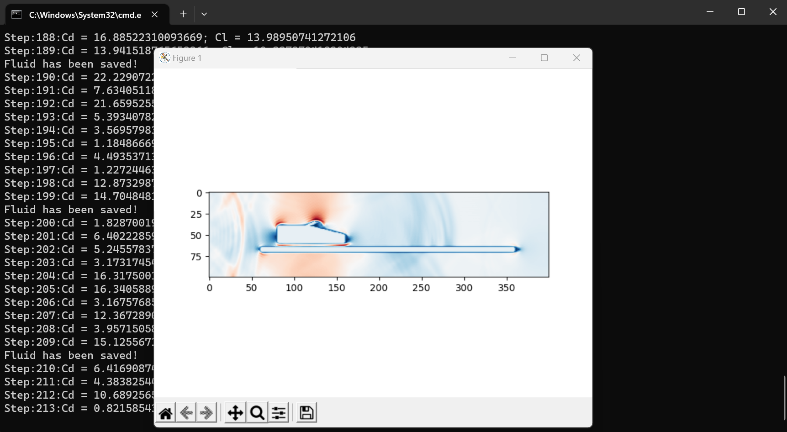
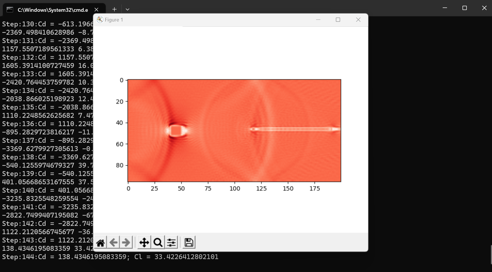

This 2D LBM solver is developed by Python without any calling, CFD simulation of 2D objects with any edges are supported. Meanwhile, this program could also become a packaged solver for other programs. For example, by adding some 4-direction switches to control the object's motion, this program will become a game environment for Deep Reinforcement Learning.

Shortcomings: 
* this solver is programed mainly by CPU, so the efficiency is not good enough for large simulations.

Next Step: 
* Some new frameworks are used for redeveloped the program, such as [Taichi parallel computing framework](https://www.taichi-lang.org/). Early simulation shows that even without GPU, the solver based on Taichi framework will also be faster than the former. 
* Meanwhile, due to the low resolution in edges capturing, the loss of simulation accuracy has not been validated, the [Immersed Boundary Method](https://www.sciencedirect.com/topics/engineering/immersed-boundary-method) should be embeded to deal with the moving object.

