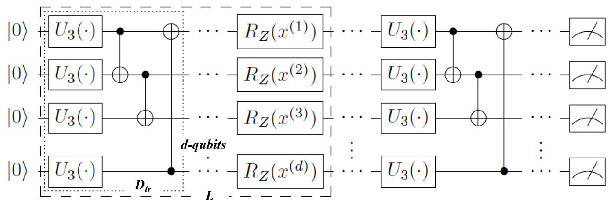
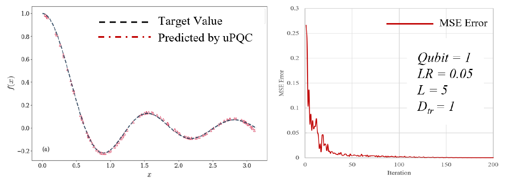
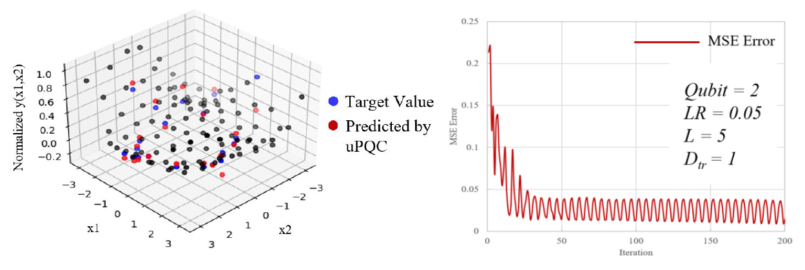

To verify the ability of the Variational Quantum Algorithm(VQA) in function fitting and prediction, a universal Parameterized Quantum Circuit(PQC) for multivariate functions is implemented based on the Baidu Paddle Quantum. Key algorithms and validation functions were derived from Zhang et al.[1]. The differences are:
* Zhang et al.[1] did not use a universal PQC to verify the predictive ability of univariate functions. In this study, all of functions use the same universal PQC, which is only controlled by the number of Pauli Gates and qubits.
* Zhang et al.[1] used more layers of universal PQC to verify the predictability of binary functions, and larger dataset sizes. This study demonstrates that the universal PQC with less layers also has good predictive ability in the case of fewer samples.

A universal PQC is shown in Figure 1:

* L is the layer of universal PQC.
* d is the number of qubits.
* Dtr is the number of combined Pauli Gates U3. By define（d，L，Dtr）, the universal PQC is fixed.
* x(d) is the independent variable of object function.

(1) Predictive experiment for a univariable function:
For given function:

Fix the universal PQC by （d，L，Dtr）=（1，5，1）. The predictive results and training errors are shown in Figure 2:

$f(x)=\frac{sin(5x)}{5x},x\epsilon[0,\pi]$

The predictive accuracy is consistent with that of Zhang et al.[1] who did not used a universal PQC. It takes only 3 minutes (CPU) for 200 iterations on a computer with a 1.1GHz CPU.

(2) Predictive experiment for a bivariable function:
For given function:

$f(x_{1},x_{2})=(x_{1}^2+x_{2}-1.5\pi)^2+(x_{1}+x_{2}^2-\pi)^2,x\epsilon[-\pi,\pi]$

Fix the universal PQC by （d，L，Dtr）=（2，5，1）. The training set is sampled with the Optimal Latin Hypercube Designs. The training set: test set = 100:20. The predictive results and training errors are shown in Figure 3, y-axle is normalized:

The predictive accuracy is consistent with that of Zhang et al. who applied a universal PQC by （d，L，Dtr）=（2，10，3）. It is shown that less layers of universal PQC and a less number of samples could also have good prediction accuracy. It takes only 7 minutes (CPU) for 200 iterations on a computer with a 1.1GHz CPU.

In addition, for the 2-qubits universal PQC, it shows that there is some randomness in the prediction process. Zhang et al.[1] applied an average of five times to eliminate randomness in the study, but the mechanism of randomness remains to be investigated.

[1] [Y. Zhang, H. S. Yao, M. J. Li, et al. "Power and limitations of single-qubit native quantum neural networks". arXiv:2205.07848, (2022).](https://arxiv.org/abs/2205.07848)

